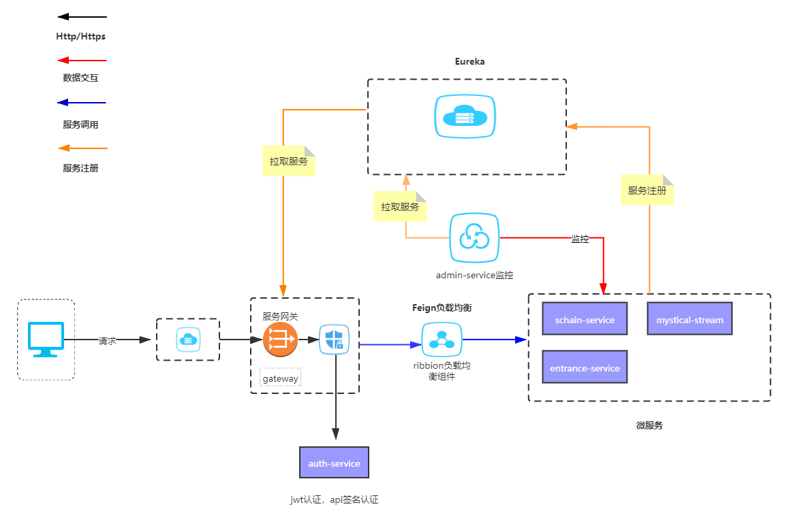
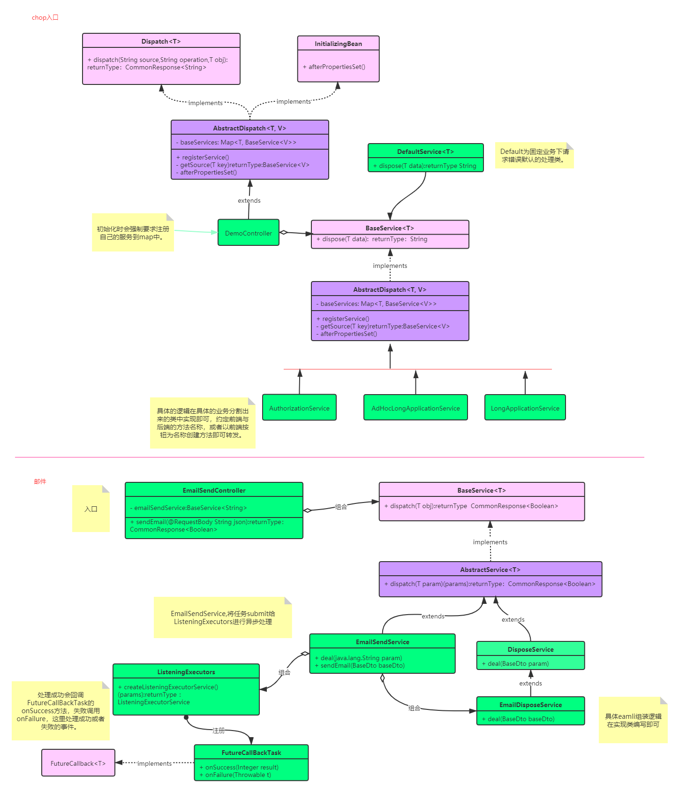

# Cloud

- [x] 短链服务

- [x] api接口签名

- [x] admin监控

- [x] gateway网关

- [x] jwt 认证

- [x] stream

- [ ] 集群部署

- [ ] 高可用注册中心

- [ ] 文件系统

- [ ] 日志系统

- [ ] 邮件系统

## 初始配置
下载后右键cloud-master的pom文件 ，add as maven将项目加入maven中。
> 
每个项目都是独立的，可以单独打开，都需要进行一次add as maven才能正常使用。
## 整体结构

## 入口逻辑图

**邮件服务暂时未在仓库中**

## 服务

### auth-service

支持JWT认证，api签名认证

### entrance-service

入口服务，供业务拓展，详见入口逻辑图

